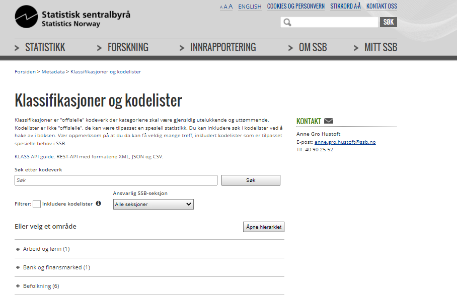

```{r setup, include=FALSE}
knitr::opts_chunk$set(echo = FALSE)
```

`ApplyKlass` is designed to provide an easy interface to applying  classifications from Statistic Norway's classification database. It can be used on a vector.

See <https://www.ssb.no/klass/> for details on Statistic Norway's classifications and codelists.

```{r, echo = FALSE, preview=TRUE}

```


### 1. Retrieving classification name
`ApplyKlass` can be used to retreive the name of a classification vector.

```{r, echo = T, results="hide"}
library(klassR)
dt <- data.frame(orgnr = c(324833,95765, 32732),
                 naering = c("01", "05", "06"))
dt$naering_name <- ApplyKlass(dt$naering, klass = 6)
dt
```

```{r}
knitr::kable(dt)
```

### 2. Language
Different languages can be fetched out. These are coded "nn" for nynorsk, "nb" for bokmål and "en" for English.

```{r, echo = T, results="hide"}
dt$naering_name <- ApplyKlass(dt$naering, klass = 6, language = "en")
dt
```

```{r}
knitr::kable(dt)
```

### 3. Change level
Sometimes a different level is desired. In this case we specify using the `output_level` parameter. 

```{r, echo = T, results="hide"}
dt$hoved_naering <- ApplyKlass(dt$naering, 
                               klass = 6,
                               output_level = 1,
                               output = "code")
dt
```

```{r}
knitr::kable(dt)
```


### 4. More help
See <https://www.ssb.no/klass/> for details on Statistic Norway's classifications and codelist.

